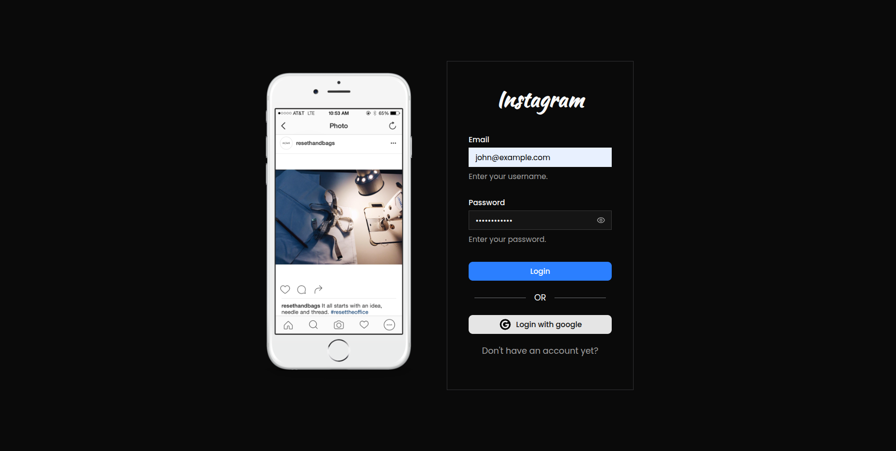
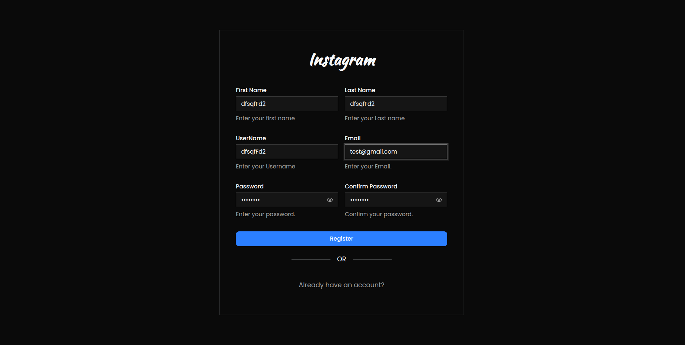
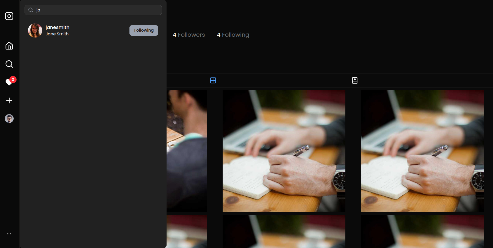
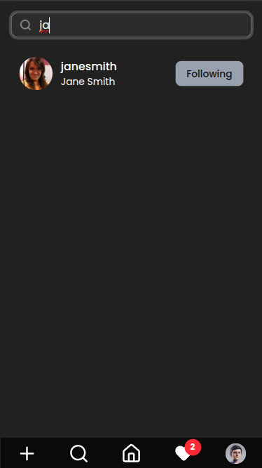
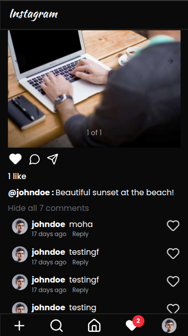
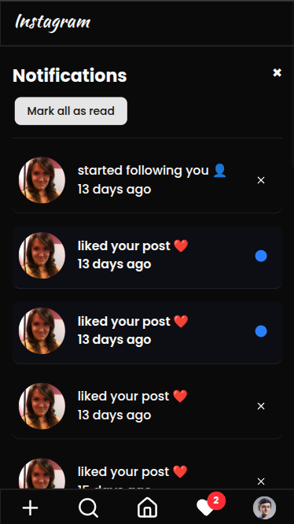

# Instagram Clone

This project is a web application designed to replicate some of the core functionalities of Instagram.

## Backend Repository

The backend for this project can be found here: [Instagram_Backend](https://github.com/Ylandolsi/Instagram_Backend)

## Features

- **Authentication:** User registration and login
- **Feed:** Infinite scrolling feed displaying posts from followed users
- **Post Creation:** Upload multiple images, crop them, add captions, and share
- **Post Interaction:** Like/unlike posts, view users who liked a post
- **Comments:** Add comments to posts, view comments, reply to comments, like/unlike comments
- **Profiles:** View user profiles, including their posts, follower count, and following count
- **Follow System:** Follow and unfollow users, view lists of followers and following
- **Notifications:** Real-time notifications for likes, comments, and follows
- **Search:** Search for users

## Tech Stack

- React, TypeScript, Vite
- Tailwind CSS, Shadcn UI

## Screenshots

**Login:**

**Register:**

**Profile/Search (Desktop):**

**Mobile Views:**

|                           Search                            |                            Comments                             |                              Notifications                               |
| :---------------------------------------------------------: | :-------------------------------------------------------------: | :----------------------------------------------------------------------: |
|  |  |  |
